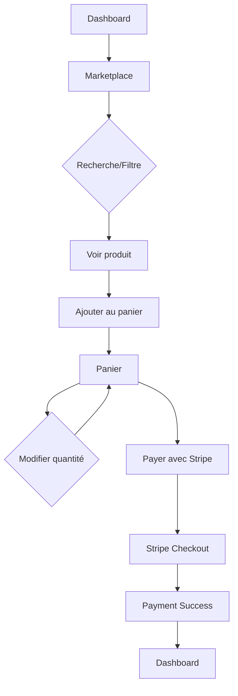

# Module Marketplace GH₂

## Vue d'ensemble

Le module Marketplace permet aux utilisateurs d'acheter des produits liés à la technologie hydrogène : kits HHO, accessoires, pièces détachées et même des véhicules équipés.

## Architecture

### Pages

1. **`/marketplace`** - Catalogue de produits
   - Liste complète des produits disponibles
   - Filtres par catégorie
   - Recherche par nom/description
   - Badge de stock
   - Ajout au panier direct

2. **`/cart`** - Panier d'achat
   - Résumé des articles
   - Modification des quantités
   - Suppression d'articles
   - Calcul du total
   - Bouton de paiement Stripe

3. **`/payment-success`** - Confirmation de paiement
   - Message de succès
   - Référence de transaction
   - Actions post-achat

## Composants

### useCart Hook

Hook personnalisé pour gérer le panier d'achat :

```typescript
const {
  cart,              // Liste des articles
  addToCart,         // Ajouter un article
  removeFromCart,    // Retirer un article
  updateQuantity,    // Modifier la quantité
  clearCart,         // Vider le panier
  getTotalPrice,     // Prix total
  getTotalItems,     // Nombre d'articles
} = useCart();
```

**Stockage**: LocalStorage (`gh2-cart`)

## Base de données

### Table `marketplace_items`

| Colonne | Type | Description |
|---------|------|-------------|
| id | uuid | Identifiant unique |
| category | text | Catégorie du produit |
| name | text | Nom du produit |
| description | text | Description détaillée |
| price | numeric | Prix en euros |
| stripe_price_id | text | ID prix Stripe (optionnel) |
| images_urls | text[] | URLs des images |
| stock_quantity | integer | Quantité en stock |
| is_available | boolean | Disponibilité |
| specifications | jsonb | Spécifications techniques |
| created_at | timestamp | Date de création |
| updated_at | timestamp | Date de modification |

### Table `marketplace_orders`

| Colonne | Type | Description |
|---------|------|-------------|
| id | uuid | Identifiant unique |
| user_id | uuid | ID utilisateur |
| items | jsonb | Articles commandés |
| total_amount | numeric | Montant total |
| status | order_status | Statut de la commande |
| stripe_payment_intent_id | text | ID session Stripe |
| shipping_address | jsonb | Adresse de livraison |
| tracking_number | text | Numéro de suivi |
| created_at | timestamp | Date de commande |
| updated_at | timestamp | Date de modification |

## Intégration Stripe

### Edge Function: `create-checkout`

Crée une session de paiement Stripe Checkout.

**Entrée**:
```json
{
  "items": [
    {
      "id": "uuid",
      "name": "Kit HHO Compact",
      "price": 2999.00,
      "quantity": 1
    }
  ]
}
```

**Sortie**:
```json
{
  "url": "https://checkout.stripe.com/..."
}
```

**Workflow**:
1. Authentification utilisateur
2. Vérification/création client Stripe
3. Création des `line_items` avec prix dynamiques
4. Création session Checkout
5. Insertion commande en DB (statut: `pending`)
6. Retour URL de paiement

**Configuration Stripe**:
- Mode: `payment` (paiement unique)
- Pays de livraison: FR, BE, CH, LU, MC
- Success URL: `/payment-success?session_id={CHECKOUT_SESSION_ID}`
- Cancel URL: `/cart`

## Catégories de produits

- **Kit HHO** : Kits complets d'installation
- **Accessoires** : Électrolyseurs, réservoirs, contrôleurs
- **Véhicules** : Véhicules équipés hydrogène
- **Pièces** : Valves, connecteurs, pièces détachées

## Flow utilisateur



## Sécurité

### RLS Policies

**marketplace_items**:
- SELECT: Public (is_available = true)
- INSERT/UPDATE/DELETE: Admin uniquement

**marketplace_orders**:
- SELECT: Utilisateur propriétaire uniquement
- INSERT: Utilisateur authentifié
- UPDATE/DELETE: Admin uniquement

### Edge Function

- Authentification obligatoire
- Validation des items
- Création commande en DB avant paiement
- Logging des erreurs

## Features futures (V2)

1. **Gestion des images**
   - Upload images produits
   - Galerie photos
   - Compression automatique

2. **Avis clients**
   - Notation produits
   - Commentaires
   - Photos clients

3. **Promotions**
   - Codes promo
   - Réductions
   - Ventes flash

4. **Suivi de commande**
   - Notifications emails
   - Tracking livraison
   - Historique commandes

5. **Wishlist**
   - Liste de souhaits
   - Partage de liste
   - Alertes stock

6. **Recommendations**
   - Produits similaires
   - Achats fréquents ensemble
   - IA recommendations

## Notes techniques

- **Cart Storage**: LocalStorage pour persistance
- **Currency**: EUR (centimes * 100 pour Stripe)
- **Stock Management**: Vérification avant ajout panier
- **Guest Checkout**: Non supporté (auth requise)
- **Shipping**: Calculé par Stripe Checkout
- **Payment Methods**: Cartes bancaires via Stripe

## URLs

- Marketplace: `/marketplace`
- Panier: `/cart`
- Succès: `/payment-success`
- Dashboard: `/dashboard`
