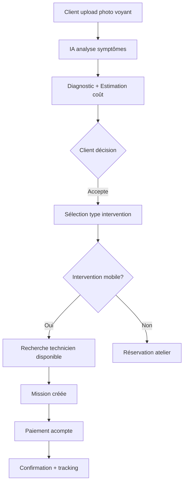
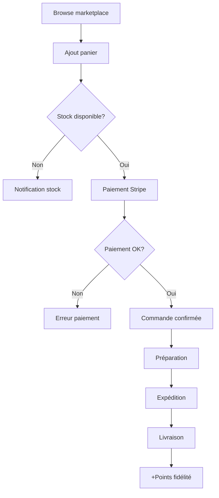
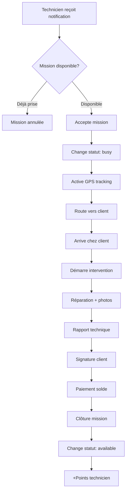
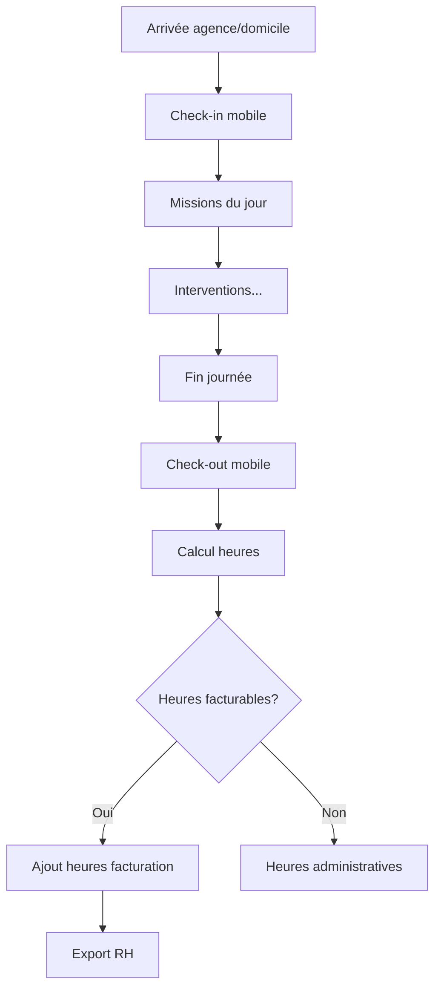
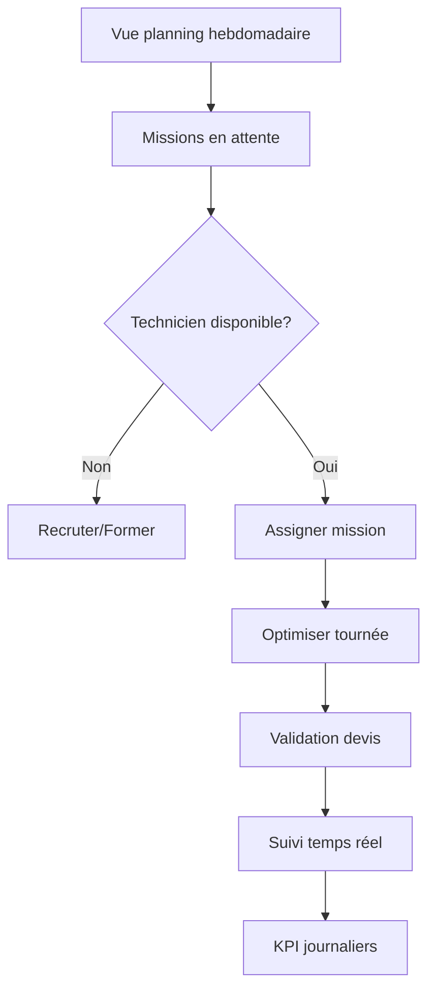
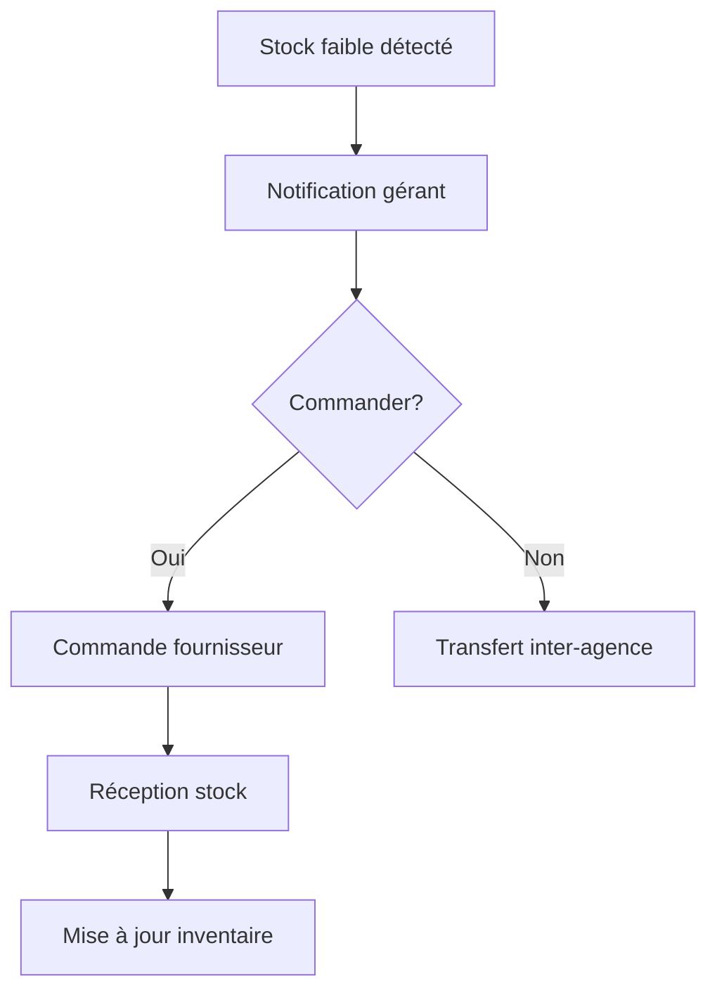
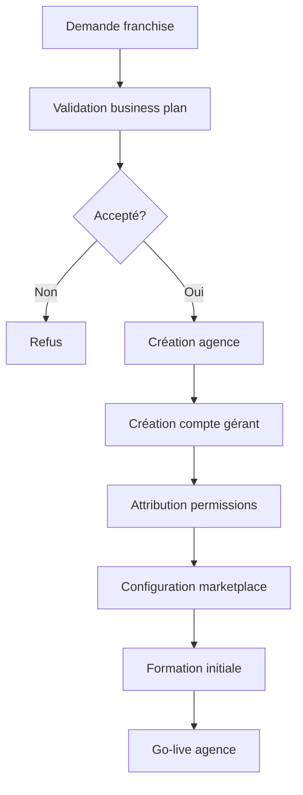
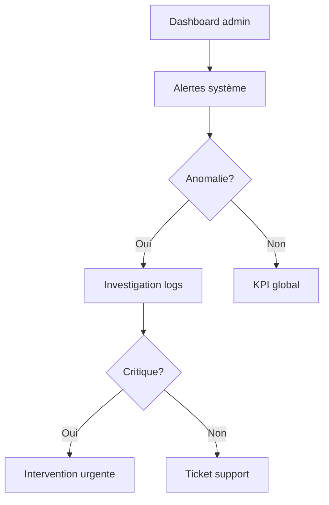
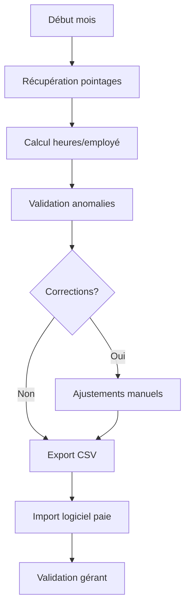

# Workflows GH₂

## Workflow Client

### 1. Diagnostic → Intervention



### 2. Achat Marketplace



---

## Workflow Technicien

### 3. Acceptation → Intervention



### 4. Pointage Journalier



---

## Workflow Gérant

### 5. Gestion Planning Agence



### 6. Gestion Stock (V2)



---

## Workflow Admin GH₂

### 7. Onboarding Nouvelle Agence



### 8. Monitoring Système



---

## Workflow RH

### 9. Export Paie Mensuel



---

## Événements Temps Réel

### Supabase Realtime

#### GPS Tracking
```typescript
// Subscribe aux positions technicien
supabase
  .channel(`mission-${missionId}`)
  .on('postgres_changes', {
    event: 'UPDATE',
    schema: 'public',
    table: 'technicians',
    filter: `id=eq.${technicianId}`
  }, (payload) => {
    updateMapPosition(payload.new.latitude, payload.new.longitude);
  })
  .subscribe();
```

#### Notifications Missions
```typescript
// Notifications nouvelles missions
supabase
  .channel('new-missions')
  .on('postgres_changes', {
    event: 'INSERT',
    schema: 'public',
    table: 'missions',
    filter: `status=eq.pending`
  }, (payload) => {
    notifyAvailableTechnicians(payload.new);
  })
  .subscribe();
```

---

## Points de Synchronisation

### Stripe Webhooks
- `payment_intent.succeeded` → Confirmer commande
- `payment_intent.failed` → Annuler mission
- `charge.refunded` → Remboursement points fidélité

### API IA Externe
- OCR carte grise → Extract VIN, plaque
- Diagnostic photo → Gravité + coût
- Analyse vidéo (optionnel) → Détails complémentaires

### n8n Workflows (V2)
- Email confirmation mission
- SMS notification technicien
- Slack alerte admin
- Export auto comptabilité

---

## États Système

### Mission States
```
pending → accepted → in_progress → completed
         ↓
      cancelled
```

### Technician States
```
offline ⟷ available ⟷ busy
```

### Order States
```
pending → processing → completed
         ↓
      cancelled
```

### Payment States
```
pending → completed
         ↓
       failed → refunded
```
